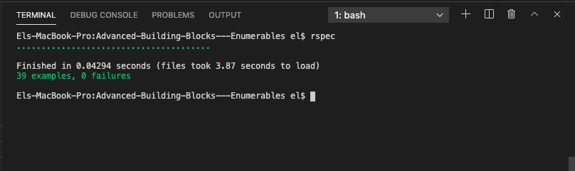

# Advanced-Building-Blocks---Enumerables
By Carlos Robles & John Durán.

This project was built with Ruby.
We created Enumerable class method.
And we work on how to create methods inside classes.

This is the list of the methods that we created:

```
my_each
my_each_with_index
my_select
my_all?
my_any?
my_none?
my_count
my_map
my_inject
multiply_els
```


## Built With

`Ruby`


## Live Demo

[Live Demo Link](https://repl.it/join/gisxltke-jelduran)


## Commands
Please properly use linters to contribute

## Running tests with Rspec

This game was tested with Rspec wich is a computer domain-specific language (DSL) testing tool written in programming language Ruby to test Ruby code. It is a behavior-driven development (BDD) framework which is extensively used in production applications.

## How to get Rspec running

- In the terminal, type `gem install rspec`
- Once done, go to project directory and type `rspec --init`
- You will see a folder `spec` and a file `.rspec`
- Inside spec folder you'll see a `spec_helper.rb` file.
- In the terminal, type `rspec`

## Rspec output



## Author

👤 Carlos Robles

- Github: [@carlos-ssh](https://github.com/carlos-ssh)
- Twitter: [@carlos-ssh](https://twitter.com/AomRobles)
- Linkedin: [@carlos-ssh](https://www.linkedin.com/in/carlos-ssh/)

## Author

👤 John Elvis Durán Montoya 

- Github: [@jelduran](https://github.com/jelduran)
- Twitter: [@jelduran](https://twitter.com/jelduran)
- Linkedin: [@jelduran](https://www.linkedin.com/in/jelduran)

👤 Tazoh Yanick Tazoh

- 👤GitHub: [Tazoh Yanick](https://github.com/t-yanick)
- Linkedin: [Tazoh Yanick](https://linkedin.com/in/tazoh-yanick-5a978764)

## Getting Started
To get a local copy up and running follow these simple example steps.

Open the terminal command line window
git clone https://github.com/jelduran/Advanced-Building-Blocks---Enumerables.git

¡Enjoy!

## 🤝 Contributing

Contributions, issues, and feature requests are welcome!

Feel free to check the [issues page](issues/).

## Show your support

Give a ⭐️ if you like this project!

## Acknowledgments

- Family
- Microverse
- GitHub

## 📝 License

This project is open licensed.
